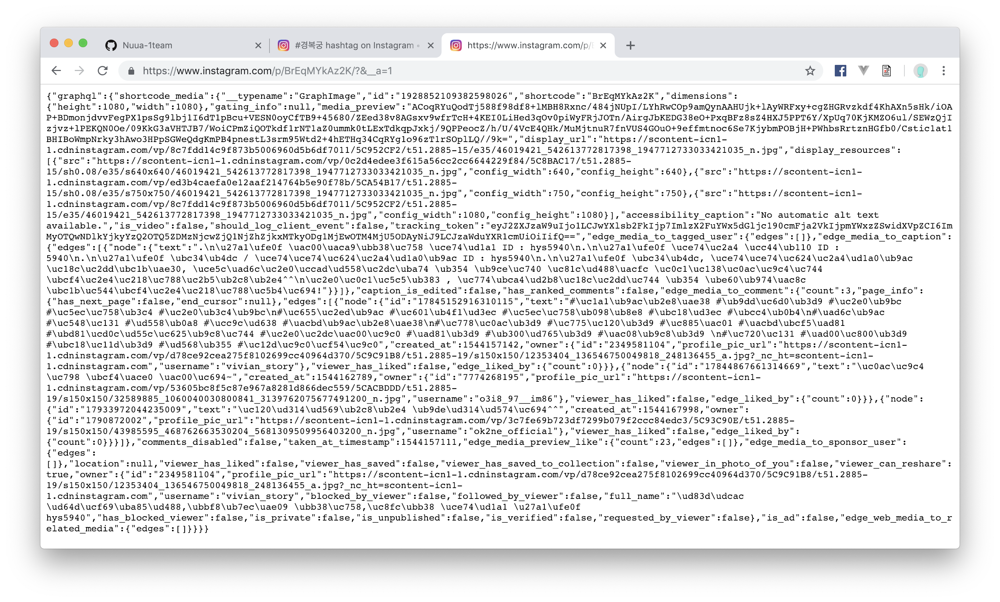

# 인스타그램 크롤러

1. 트립 어드바이저와 동일하게 selenium사용 

2. 태그 검색 했을때 그 페이지에서 스크롤을 계속 내리면서 새로 ajax로 불러와지는 게시물들의 고유 url ( 번호 ) 을 가져옴

3. 그 고유 번호를 통해서 인스타 게시물에 request를 보냄

   * script에 있는 데이터 크롤링

   

4.  혹은 json 불러와지는 주소로  request를 보냄

   

* 각각의 게시물에 접근하는 부분은 selenium을 사용 안하고 requests만 날려서 하는 방법으로 효율 늘림

